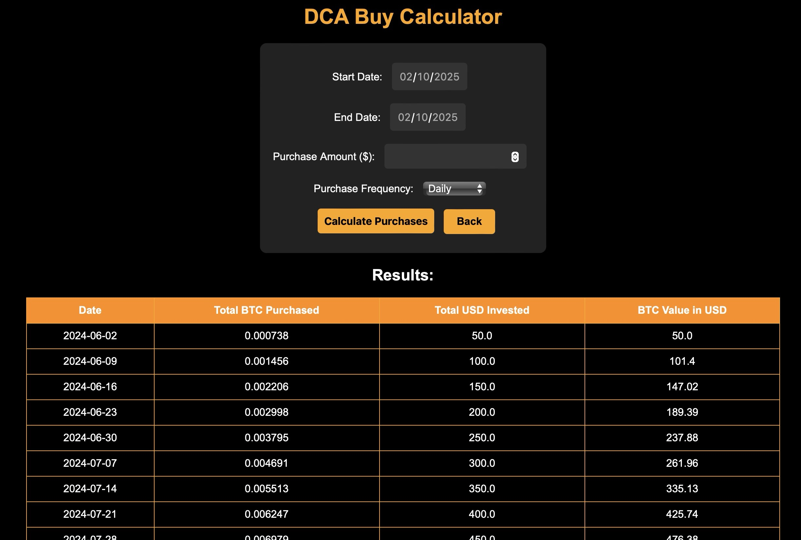
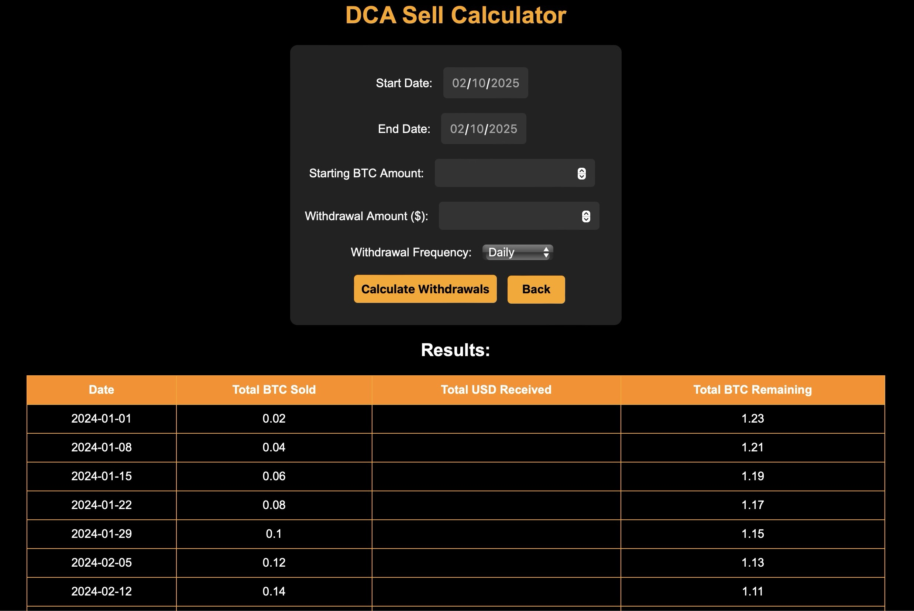

# DCA Buy & Sell Calculator

## Overview
This project provides two calculators for Dollar-Cost Averaging (DCA) investments in bitcoin using historical (10 years or less) price data:
- **DCA Buy Calculator**: Calculates bitcoin purchases over time based on user-defined parameters.
- **DCA Sell Calculator**: Simulates DCA sales on user-defined intervals, anounts, and starting bitcoin balances.

## Features
- User-friendly web interface with a **dark theme** for readability.
- Input fields for custom user-defined scenarios.
- Calculation of **total BTC purchased/sold**, **USD invested/received**, and **BTC value over time**.
- Responsive design for desktop and mobile users.

## Technologies Used
- **HTML, CSS** for front-end design.
- **Flask (Python)** for back-end processing.
- **Jinja2** for rendering dynamic content.
- **Yahoo Finance API** for gathering historical price data.

## Setup & Installation
1. **Clone the repository:**
   ```sh
   git clone https://github.com/your-repo/dca-calculator.git
   cd dca-calculator
   ```
2. **Create a virtual environment (optional but recommended):**
   ```sh
   python -m venv venv
   source venv/bin/activate  # On Windows use: venv\Scripts\activate
   ```
3. **Install dependencies:**
   ```sh
   pip install flask
   ```
4. **Run the Flask application:**
   ```sh
   python app.py
   ```
5. **Access the web interface:**
   Open a browser and go to `http://127.0.0.1:5000/`

## Usage
1. **DCA Buy Calculator:**
   - Enter the start and end dates.
   - Specify the investment amount per period.
   - Choose the purchase frequency (daily, weekly, biweekly, or monthly).
   - Click "Calculate Purchases" to view the results.

   
2. **DCA Sell Calculator:**
   - Enter the start and end dates.
   - Enter the starting BTC balance. 
   - Enter the USD value of BTC sales.
   - Select the sale frequency.
   - Click "Calculate Sales" to get FIFO-based breakdowns.


## Future Improvements
- Integration of **real-time BTC price ticker**.
- Price **chart** generation.
- **Asset comparison** tool (Bitcoin vs. any stock ticker). 

## Contributing
Feel free to submit issues, suggestions, or pull requests to improve the project.

## License
This project is open-source and available under the **MIT License**.

---
Built with 💡 and ☕ by Jonathan Halfhide
